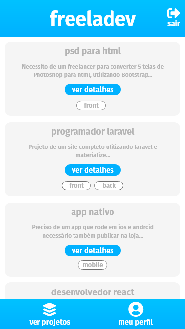
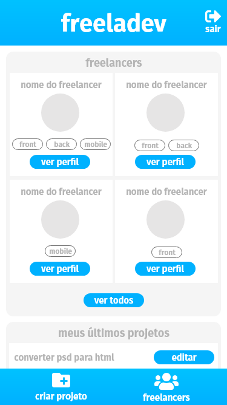
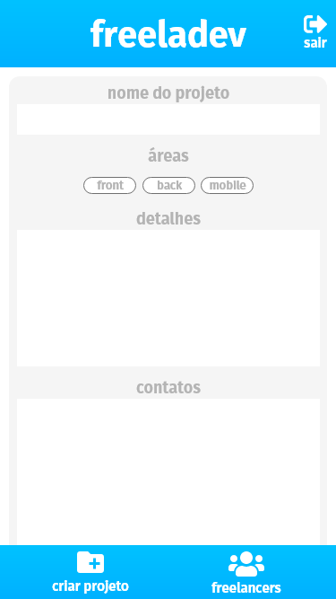

<h1>app em react native com persistência de dados utilizando firebase</h1>
<h2>screenshots:</h2>
<h3>login</h3>

<h3>cadastro</h3>

<h3>tela inicial para o dev</h3>

<h3>listagem projetos</h3>

<h3>detalhes do projeto</h3>

<h3>tela inicial para cliente</h3>

<h3>tela de criar projeto</h3>
